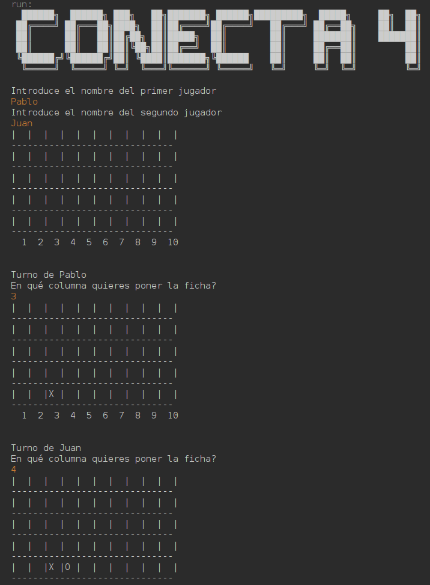
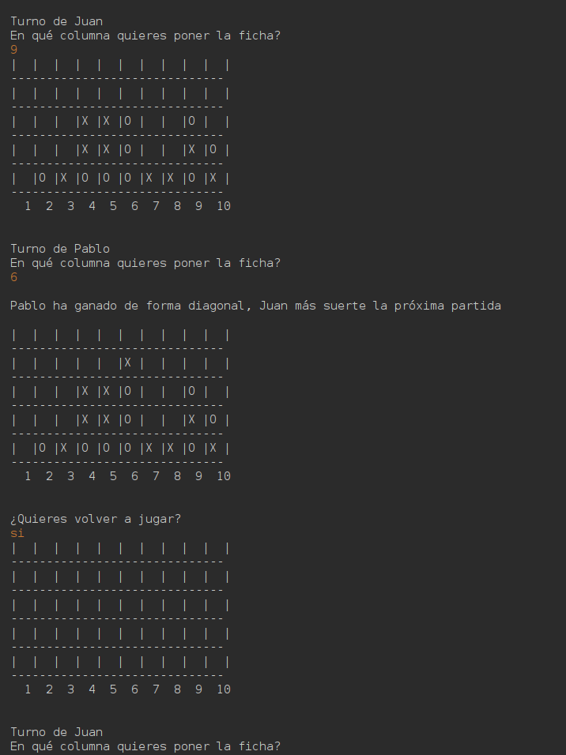

# Conecta 4 🎮
Un juego clásico de Conecta 4 desarrollado en Java, jugable desde la consola.

## 📸 Capturas de pantalla

### Inicio de la partida


### Final de la partida


## 🚀 Características
- Juego para dos jugadores
- Comprobación automática de victoria (horizontal, vertical y diagonal)
- Reinicio de partida tras finalizar
- Interfaz en consola

## 🛠️ Instalación
Clona este repositorio y ejecuta el juego:
```bash
 git clone https://github.com/DavidPicazoE/Conecta4-Java.git
 cd Conecta4-Java
 javac Conecta4.java
 java Conecta4
```

## 🧠 Cómo jugar
1. Introduce los nombres de los dos jugadores.
2. Por turnos, selecciona la columna donde quieres dejar caer tu ficha.
3. El primer jugador que consiga conectar 4 fichas gana.
4. ¡Diviértete y desafía a tus amigos!

## 👨‍💻 Autor
- **David Picazo** — [GitHub](https://github.com/DavidPicazoE)

¡Que gane el mejor! 🏅

